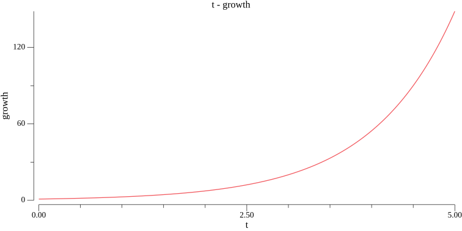

# growth
Growth code in Go

Exponential growth is quite simple:

$$
\frac{dN}{dt}=(b-d)N
$$

$b$ is the birthrate, $d$ is the deathrate and $(b-d)$ is called intrinsic rate of natural increase. Solving this we get

$$
N(t)=c e^{(b-d) t}
$$

Here is a plot of expoential growth setting $c=1$ and $(b-d)=1$:

This cannot be correct, resources, for example, food, are limited and at some point growth has to slow down.